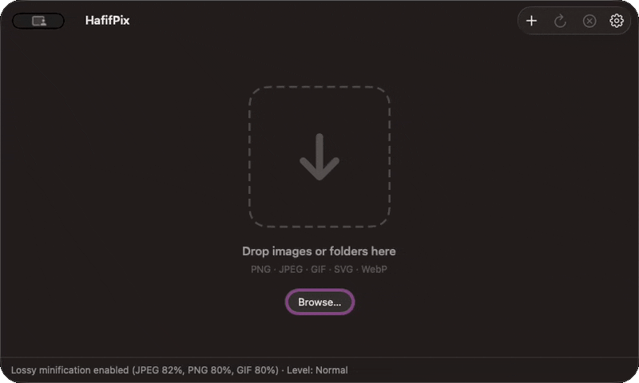
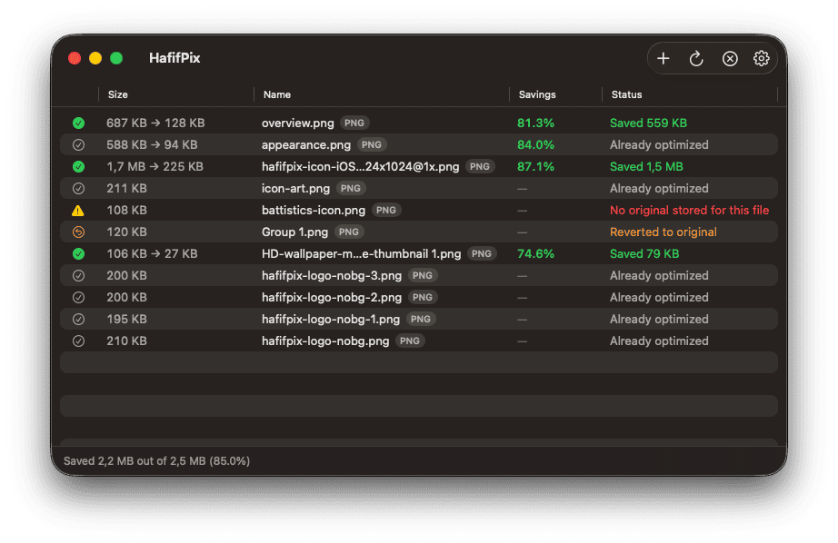
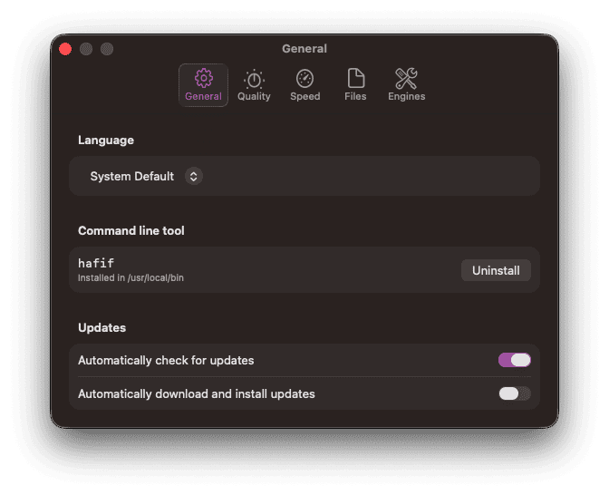
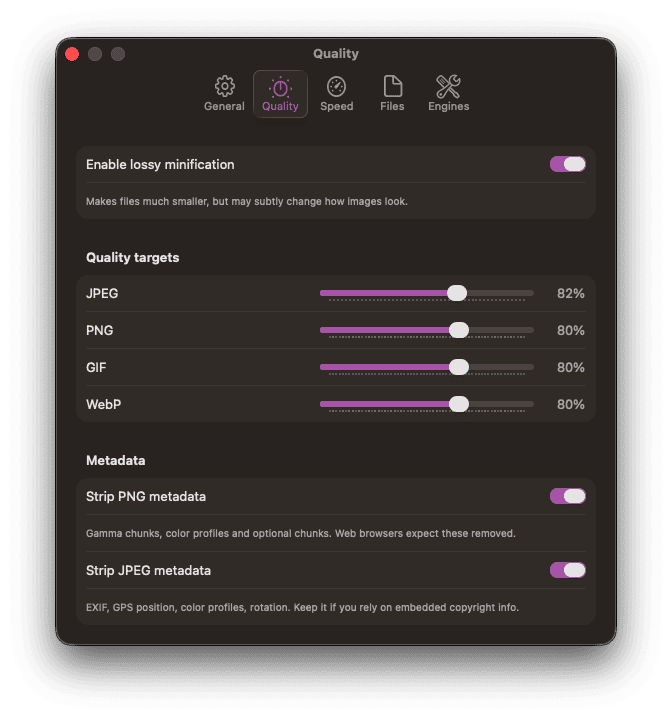
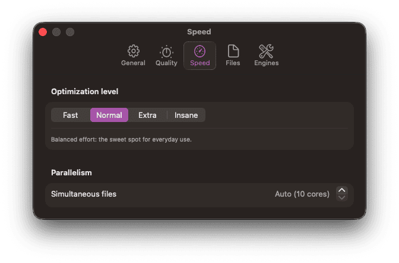
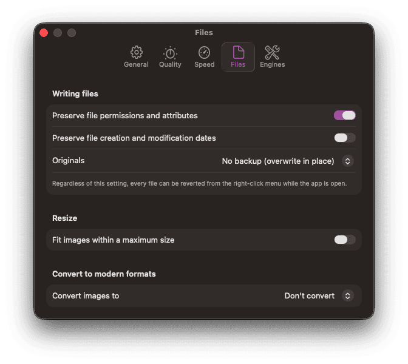
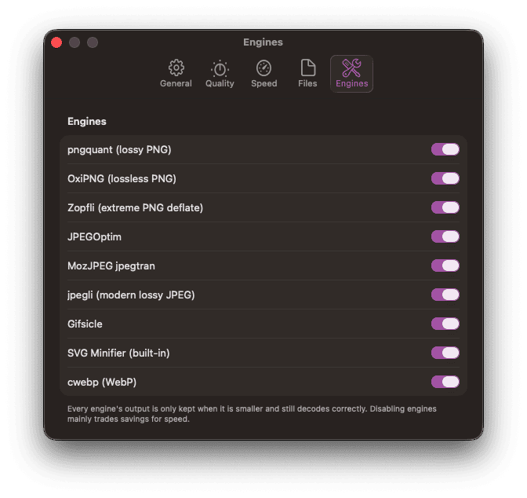

<p align="center">
  
</p>

<h1 align="center">HafifPix</h1>

<p align="center">
  A native macOS image optimizer. Drop images or folders, they shrink in place.<br>
  <em>hafif</em> (Turkish: lightweight) + <em>pix</em>. Swift 6 / SwiftUI · Apple Silicon
</p>

<p align="center">
  
</p>

Losslessly by default, or lossy at your chosen quality. Files are never made
larger and never corrupted: every optimizer pass is adopted only if the
result is smaller and still decodes with identical dimensions and frame count.

<p align="center">
  
</p>

## Features

- **Formats**: PNG, JPEG, GIF (incl. animated), SVG, WebP
- **Modern engines**, bundled inside the app with no dependencies: oxipng,
  pngquant, MozJPEG, jpegoptim, gifsicle and cwebp
- **Convert to modern formats**: WebP / HEIC / AVIF as sibling files;
  animated GIF becomes animated WebP
- **Resize on optimize**: fit within a max dimension before compressing
- **Background removal**: extract the subject to a transparent PNG. Flat
  backgrounds get a pixel-exact flood fill; photos use Apple's Vision model
- **Sortable results table**: click any column (state, name, size, savings,
  status); column widths and order persist
- **Safety**: atomic same-volume swaps, optional Trash or sidecar backups,
  and per-file *Revert to Original* for the whole session
- **`hafif` CLI** for scripts and CI, sharing the app's engine and settings
- **Finder integration**: Open With, Services menu, dock drops

## Install

```sh
brew install --cask doguyilmaz/tap/hafifpix
```

Installs the app and puts the `hafif` CLI on your PATH.

Or download the DMG from
[Releases](https://github.com/doguyilmaz/hafifpix/releases) and drag HafifPix
to Applications — then `make install-cli` for the CLI.

Either way updates arrive in-app: HafifPix updates itself, so Homebrew is told
to leave it alone once installed.

## Settings

<table>
  <tr>
    <td align="center"><br><sub>General</sub></td>
    <td align="center"><br><sub>Quality</sub></td>
    <td align="center"><br><sub>Speed</sub></td>
    <td align="center"><br><sub>Files</sub></td>
    <td align="center"><br><sub>Engines</sub></td>
  </tr>
</table>

## Build

Requires Xcode command line tools and the Homebrew-installed engines:

```sh
brew install oxipng pngquant mozjpeg jpegoptim gifsicle webp
make app          # build dist/HafifPix.app (self-contained)
make run          # build and open
make install      # copy to /Applications
make install-cli  # symlink hafif into a directory on your PATH
make test         # unit tests
```

The bundling script copies the engine binaries and their dylibs into the app
and re-links them, so the built app runs on Macs without Homebrew.

## CLI

```sh
hafif ~/Desktop/screenshots            # optimize a folder in place
hafif --lossless photo.png             # never change pixels
hafif --quality 70 --level insane .    # crunch hard
hafif --convert webp --resize 2048 img.png
hafif --backup trash *.jpg             # originals go to Trash
```

## Optimization chains

Each step's output is kept only if smaller and valid:

| Format | Chain |
|--------|-------|
| PNG    | pngquant (lossy), then oxipng (Zopfli at Insane) |
| JPEG   | jpegli\* (lossy), then jpegoptim, then MozJPEG jpegtran |
| GIF    | gifsicle (per-level optimization, optional lossy) |
| SVG    | built-in minifier (comments, editor metadata, whitespace) |
| WebP   | cwebp re-encode (lossless sources stay lossless) |

\* jpegli is used automatically if a `cjpegli` binary is on the system.

## Architecture

```
Sources/
  HafifPixCore/   engine library, no UI
    Models/       formats (magic-byte sniffing), settings, job states
    Engine/       actor job queue, per-format chains, process runner,
                  ImageIO codec, SVG minifier, convert pipeline
    Safety/       atomic replacement, backups, session revert cache
  HafifPixApp/    SwiftUI app (drop zone, live table, settings)
  hafif/          CLI
```

## Languages

English, Turkish, German, French, Spanish, Japanese and Simplified Chinese.
To help translate, edit the catalogs in `Localization/*.xcstrings`, run
`make strings` and open a pull request.

## License

GPL v3, see [LICENSE](LICENSE). HafifPix bundles GPL-licensed engines, which
makes GPL the natural license for the distributed bundle. See
[THIRD_PARTY_LICENSES.md](THIRD_PARTY_LICENSES.md) for attributions. Inspired
by [ImageOptim](https://imageoptim.com).
